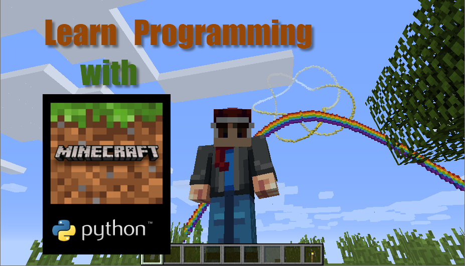
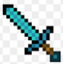
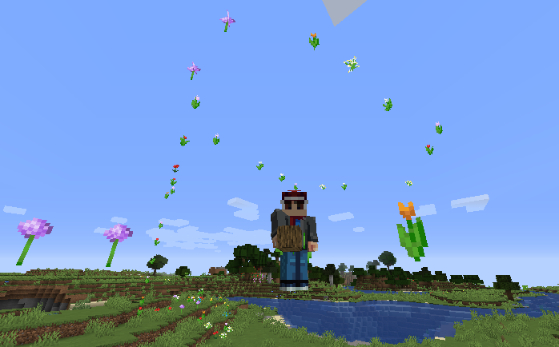

# Python programming with minecraft

<!-- Introductions and Python Code examples for kids to learn python programming with minecraft.  The Python code will run  with a modified MCPI (Pi edition API Python Library) call `mcpi-e`, and a mincraft server call spigot with the  RaspberryJuice plugin installed. -->

> **Our goal is to learn programming while having fun in Minecraft**



------

## 0  Pre-Request

### 0.1 Install Minecraft Java edition

Go to minecraft website download the Java Edition

- [link to download Minecraft java edition](https://www.minecraft.net/en-us/download/)

### 0.2 Setup mincraft server

- **[How to setup a mincraft server (spigot)](./documents/1_SetUpMineCraftServer/1.1_HowToSetUpMineCraftServer.md)**
  
- **[How to enable Python on the Minecraft server by installing the RaspberryJuice plugin](./documents/1_SetUpMineCraftServer/1.2_HowToEnablePythonForMineCraftServer.md)**

### 0.3 Install Python

Go to Python download page, download and install **Python 3.8** and up

- [To the page of download ptyhon](https://www.python.org/downloads/)
- [How to Install Python](https://onedrive.live.com/?authkey=%21ABw%2DLzmG9zyRWFA&cid=61E2F373B0D0BEF9&id=61E2F373B0D0BEF9%2150723&parId=61E2F373B0D0BEF9%2150531&o=OneUp)

### 0.4 Install mcpi Python module

#### Window

>*input below script in the command line. (from start, search "cmd")*

- use `pip3`
  
  ```bash
  pip3 install mcpi-e
  ```

- or use `py` or `python -m`
  
  ```bash
  py -m pip install mcpi-e
  ```

#### Linux / MacOS

- sudo pip3 install mcpi-e

### 0.5 Install a Python Editor

- Python IDLE
  - [IDLD](https://en.wikipedia.org/wiki/IDLE) is commine with Python, Open it by in Start->Search, Input "IDLE"
  - For how to [use IDLE](https://realpython.com/python-idle/)
  
- PyCharm
  - **PyCharm Edu** is a python editor help you learn Python
  - Click to download [pyCharm Edu](https://www.jetbrains.com/edu-products/download)

- VsCode
  - **VsCode** is a editor for many different programming langurage.
  - Click to download [VsCode](https://code.visualstudio.com/)
  - [How to install VsCode for python](https://onedrive.live.com/?authkey=%21ABw%2DLzmG9zyRWFA&cid=61E2F373B0D0BEF9&id=61E2F373B0D0BEF9%2150724&parId=61E2F373B0D0BEF9%2150531&o=OneUp)

------

## 1. Get Start Python with Minecraft

### 1.1 Connect to the Minecraft server and get your position

Create a Python project folder, Download and save the sample1.py file to  your python project folder
   >[sample1.py](./0.1-Sample1.py)

```python
from mcpi_e.minecraft import Minecraft

serverAddress="127.0.0.1" # change to your minecraft server
pythonApiPort=4711 #default port for RaspberryJuice plugin is 4711, it could be changed in plugins\RaspberryJuice\config.yml
playerName="stoneskin" # change to your username

mc = Minecraft.create(serverAddress,pythonApiPort,playerName)
pos = mc.player.getPos()

print("pos: x:{},y:{},z:{}".format(pos.x,pos.y,pos.z))
```

Use your faverate python editor to open the sample1.py file.
When you install python, it come with a python editor call IDLE.j

### 1.2. Frequently used `mcpi` commands

#### 1.2.1 Find your location

> get the tile position

```python
pos = mc.player.getTilePos()

```

#### 1.2.2 Teleport

> move player to north 100 block

```python
x,y,z = pos = mc.player.getTilePos()
mc.player.setTilePos(x,y+100,z)
```

#### 1.2.3 Set block

>set the a stone block beside the player

```python
x,y,z = pos = mc.player.getTilePos()
mc.setBlock(x+1, y, z, 1)
```

>setblock with constants block.STONE.id

```python
#setblock with constants block.STONE.id
from mcpi_e import block
(x,y,z) = pos = mc.player.getTilePos()
mc.setBlock(x+1, y, z+1, block.STONE.id)
```

>set special block which extra properties

```python
# set special block which extra properties
flower = 38
flowerColor = 3
mc.setBlock(x+1, y, z+1, flower, flowerColor)
```

#### 1.2.4 Get block

>get the block type id of the player stepping on

```python
# get the block current player step on
x, y, z = mc.player.getTilePos()
blockId= mc.getBlock(x, y, z)
if(blockId == 0):
   print("current block is Air")
```

#####[ Check the Minecraft Item ID list](https://minecraft-ids.grahamedgecombe.com/)

------

## 2 Learn Python With Minecraft

#### To use the code examples in this site, please make sure include the piece of code below before the sample codes

```python
import mcpi_e.minecraft as minecraft
import mcpi_e.block as block
from math import *

address="127.0.0.1" # change to address of your minecraft server
name ="change you your name"
mc = minecraft.Minecraft.create(address,4711,name)
pos=mc.player.getTilePos()

#your other code below
...

```

### 2.1 [Understand the coordinates of minecraft](./document/../documents/2_LearnPythonWithMineCraft/2.1_Understand_the_coordinates_of_minecraft.md)

Minecraft coordinates are different than what we learn from geomestry. You need keep the picture below in mind when you do the minecraft coding.
[](./document/../documents/2_LearnPythonWithMineCraft/2.1_Understand_the_coordinates_of_minecraft.md)

For basic python syntax, pleas check [Python syntax](https://www.w3schools.com/python/python_syntax.asp) for details.

The missions/codes below will use `print` and command from minecraft api `mcpi`

#### [ Click to view your Mincraft-Python Missions-1](./document/../documents/2_LearnPythonWithMineCraft/2.1_Understand_the_coordinates_of_minecraft.md)

### 2.2 [Use `for` Loop to stack blocks](./documents/2_LearnPythonWithMineCraft/2.2_Use_for_loop_to_stack_blocks.md#2-use-for-loop-to-stack-blocks)

`for loops` are traditionally used when you have a block of code  which you wnat to repeat number of times.
```
for x in range(0, 3):
    print("We're on time %d" % (x))
```
For learnning how to use `for` loop, please visit [Python For Loops](https://wiki.python.org/moin/ForLoop)

Below mission only need using `for ... range` loop.

#### [Click to view your Coding Missions -2](./documents/2_LearnPythonWithMineCraft/2.2_Use_for_loop_to_stack_blocks.md#2-use-for-loop-to-stack-blocks)

### 2.3 [Value Type: String , Number](./documents/2_LearnPythonWithMineCraft/2.3_ValueType_string_number.md)

In Python any amount of text call a `string`, you could use string like this

```python
print("Hello Minecraft")

name ="Steve the Miner"

print(name)
```
String and Intiger is different DataType, for detail please read [Python Data Types](https://www.w3schools.com/python/python_datatypes.asp).
Below is the Data Types we possible will used in our class


example of get type of a variable:

```python
x = 5
print(type(x))
```

The data you got form input is a string, we need convert to number before using as number. `int(str)` could do this job.

```python
blockType=input("Enter a block type:")
blockTypeId=int(blockType)

```

other way if you want change a int to string, you could use `str(number)`

```python
value=103
print("Watermelon block id is "+str(value))
```

#### [Click to view your Coding Missions -3](./documents/2_LearnPythonWithMineCraft/2.3_ValueType_string_number.md)

### 2.4 [Use Condition `if ... else`](./documents/2_LearnPythonWithMineCraft/2.4_Use_condition_minecraft_to_find_block.md)

To learn comdition please check [Python If...Else](https://www.w3schools.com/python/python_conditions.asp)

Booleans represent one of two values: `True` or `False`

For learn more and practic Boolean, please check [Python Boolean](https://www.w3schools.com/python/python_booleans.asp)


#### [Click to view your Coding Missions -4](./documents/2_LearnPythonWithMineCraft/2.4_Use_condition_minecraft_to_find_block.m)

------

## 3 More Code Samples

### 3.1 Dropping the flowers when you move

- code example 1: [dropflower.py](./samples/dropflower.py)
- code example 2 : [dropflower_Withsize.py](./samples/dropflower_withsize.py)

>Set a random flower on where the play is standing

```python
   flower = 38
   while True:
      x, y, z = mc.playerEn.getPos()
      blockId= mc.getBlock(x, y, z)
      print("current block:" + str(mc.getBlock(x, y, z)))
      if(blockId==0 or blockId ==78):
         mc.setBlock(x, y, z, flower,randrange(8))
      sleep(0.2)
```



### 3.2 Build a rainbow in the minecraft

>code example: [rainbow.py](./samples/rainbow.py)
>build a rainbow with colored wool on the player's location

```python
   import mcpi_e.minecraft as minecraft
   import mcpi_e.block as block
   from math import *

   address="127.0.0.1" # change to your minecraft server
   name ="change you your name"
   mc = minecraft.Minecraft.create(address,4711,name)
   playerPos=mc.player.getTilePos()
   colors = [14, 1, 4, 5, 3, 11, 10]
   height=50

   for x in range(0, 128):
         for colourindex in range(0, len(colors)):
                  y = playerPos.y+sin((x / 128.0) * pi) * height + colourindex
                  mc.setBlock(playerPos.x+x - 64,  int(y), playerPos.z, block.WOOL.id, colors[len(colors) - 1 - colourindex])
   print("rainbow created at x:{} y:{} z:{}".format(playerPos.x,playerPos.y,playerPos.z))

```


