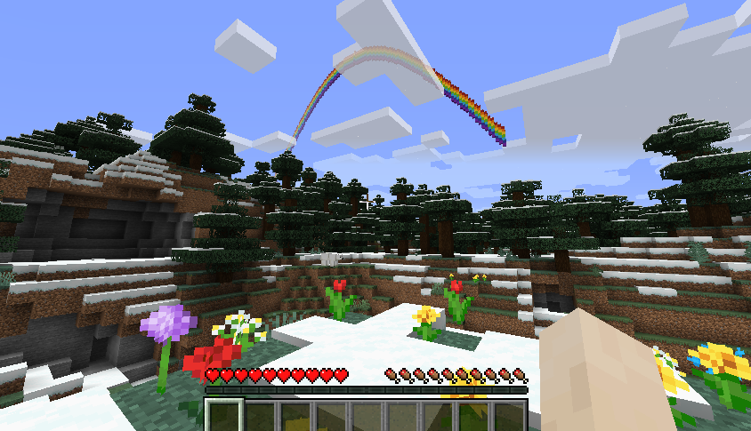

# python-minecraft

Introductions and Python Code example for kids to learn python programming with minecraft.   The code will running  with modified MCPI (Pi edition API Python Library), and a spigot build mincraft server with  RaspberryJuice plugin installed.

> **Our goal is to learn programming while having fun in Minecraft**


## Prerequest

### Setup mincraft server

- **[How to setup spigot mincraft server](./documents/1_SetUpMineCraftServer/1.1_HowToSetUpMineCraftServer.md)**
  
- **[How to enablue Python on Minecraft server by install RaspberryJuice plugin](./documents/1_SetUpMineCraftServer/1.2_HowToEnablePythonForMineCraftServer.md)**

### install mcip Python module

#### window

>*input below scrit in the command line. (from start, search "cmd")*

- use `pip3`
  
  ```bash
  pip3 install mcpi-e
  ```

- or use `py` or `python -m`
  
  ```bash
  py -m pip install mcpi-e
  ```

#### linux / MacOS

- sudo pip3 install mcpi-e

## Code Samples

### 1. Connect to Minecraft server and get your position

   >[sample1.py](./0.1-Sample1.py)

```python
   from mcpi_e.minecraft import Minecraft

   serverAddress="127.0.0.1" # change to your minecraft server
   pythonApiPort=4711 #default port for RaspberryJuice plugin is 4711, it could be changed in plugins\RaspberryJuice\config.yml
   playerName="stoneskin" # change to your username

   mc = Minecraft.create(serverAddress,pythonApiPort,playerName)
   pos = mc.player.getPos()

   print("pos: x:{},y:{},z:{}".format(pos.x,pos.y,pos.z))
```

### 2. Frequency use `mcpi` commands

#### 2.1 Find your location

> get the tile position

```python
   pos = mc.player.getTilePos()

```

#### 2.2 Teleport

> move player to north 100 block

```python
   x,y,z = pos = mc.player.getTilePos()
   mc.player.setTilePos(x,y+100,z)
```

#### 2.3 Set block

>set the a stone block beside the player

```python
   x,y,z = pos = mc.player.getTilePos()
   mc.setBlock(x+1, y, z, 1)
```

>setblock with constants block.STONE.id

```python
   #setblock with constants block.STONE.id
   from mcpi_e import block
   (x,y,z) = pos = mc.player.getTilePos()
   mc.setBlock(x+1, y, z+1, block.STONE.id)
```

>set special block which extra properties

```python
   # set special block which extra properties
   flower = 38
   flowerColor = 3
   mc.setBlock(x+1, y, z+1, flower, flowerColor)
```

#### 2.4 Get block

>get the block current player step on

```python
   # get the block current player step on
   x, y, z = mc.player.getTilePos()
   blockId= mc.getBlock(x, y, z)
   if(blockId == 0):
      print("current block is Air")
```

### 3 Drop the flower when you move

- code example 1: [dropflower.py](./samples/dropflower.py)
- code example 2 : [dropflower_Withsize.py](./samples/dropflower_withsize.py)

>Set a random flower on where the plaer step on

```python
   flower = 38
   while True:
      x, y, z = mc.playerEn.getPos()
      blockId= mc.getBlock(x, y, z)
      print("current block:" + str(mc.getBlock(x, y, z)))
      if(blockId==0 or blockId ==78):
         mc.setBlock(x, y, z, flower,randrange(8))
      sleep(0.2)
```


### 4 Build a rainbow in the minecraft

>code example: [rainbow.py](./samples/rainbow.py)
>build a rainbow with color wool on the player'slocation

```python
   import mcpi_e.minecraft as minecraft
   import mcpi_e.block as block
   from math import *

   address="127.0.0.1" # change to your minecraft server
   name ="change you your name"
   mc = minecraft.Minecraft.create(address,4711,name)
   playerPos=mc.player.getTilePos()
   colors = [14, 1, 4, 5, 3, 11, 10]
   height=50

   for x in range(0, 128):
         for colourindex in range(0, len(colors)):
                  y = playerPos.y+sin((x / 128.0) * pi) * height + colourindex
                  mc.setBlock(playerPos.x+x - 64,  int(y), playerPos.z, block.WOOL.id, colors[len(colors) - 1 - colourindex])
   print("rainbow created at x:{} y:{} z:{}".format(playerPos.x,playerPos.y,playerPos.z))

```



## Learn Python With MineCraft

### 1 [Understand the coordinates of minecraft](./documents/5_LearnPythonWithMineCraft/LearnPythonWithMineCraft.md)

Minecraft coordinates is different than what we learn from geomestry. you need keep below picture in mind when you do the minecraft codeing.


For basic python syntax, pleas check [Python syntax](https://www.w3schools.com/python/python_syntax.asp) for details.
Below mission will use `print` and command from minecraft api `mcpi`

#### To use below code example, please make sure use below code before the sample code.

```python
import mcpi_e.minecraft as minecraft
import mcpi_e.block as block
from math import *

address="127.0.0.1" # change to address of your minecraft server
name ="change you your name"
mc = minecraft.Minecraft.create(address,4711,name)
pos=mc.player.getTilePos()
```

#### - [[Mission-1.1] find your location](./documents/2_LearnPythonWithMineCraft/2.1_Understand_the_coordinates_of_minecraft.md#--mission-11-find-your-location)

#### - [[Mission-1.2] find the block type id of the block you stand on](./documents/2_LearnPythonWithMineCraft/2.1_Understand_the_coordinates_of_minecraft.md#--mission-12-find-the-block-type-id-of-the-block-you-stand-on)

#### - [[Mission-1.3] Teleport you to a exactly position](./documents/2_LearnPythonWithMineCraft/2.1_Understand_the_coordinates_of_minecraft.md#--mission-13-teleport-you-to-a-exactly-position)

#### - [[Mission-1.4] Teleport you to one direction with 100 blocks](./documents/2_LearnPythonWithMineCraft/2.1_Understand_the_coordinates_of_minecraft.md#--mission-14-teleport-you-to-one-direction-with-100-blocks)

#### - [[Mission-1.5] Place a block on your location](./documents/2_LearnPythonWithMineCraft/2.1_Understand_the_coordinates_of_minecraft.md#--mission-15-place-a-block-on-your-location)

### 2 [Use `for` Loop to stack blocks](./documents/2_LearnPythonWithMineCraft/2.2_Use_for_loop_to_stack_blocks.md#2-use-for-loop-to-stack-blocks)

#### - [[Mission-2.1]Stack 5 blocks without loop](./documents/2_LearnPythonWithMineCraft/2.2_Use_for_loop_to_stack_blocks.md#--mission-21stack-5-blocks-without-loop)

#### - [[Mission-2.2] Stack 5 blocks using For loop](./documents/2_LearnPythonWithMineCraft/2.2_Use_for_loop_to_stack_blocks.md#--mission-22-stack-5-blocks-using-for-loop)


#### - [[Mission-2.3] Build a 5X5 wall](./documents/2_LearnPythonWithMineCraft/2.2_Use_for_loop_to_stack_blocks.md#--mission-23-build-a-5x5-wall)

#### - [[Mission-2.4] Build a 5x5x5 Cube](./documents/2_LearnPythonWithMineCraft/2.2_Use_for_loop_to_stack_blocks.md#--mission-24-build-a-5x5x5-cube)

#### - [[Challenge] [Mission-2.5] Build a 10x10X10 pyramid in minecraft](./documents/2_LearnPythonWithMineCraft/2.2_Use_for_loop_to_stack_blocks.md#--challenge-mission-25-build-a-10x10x10-pyramid-in-minecraft)

### 3 [Use Condition `if...else`](./documents/2_LearnPythonWithMineCraft/2.3_Use_condition_minecraft_to_find_block.md#3-use-condition-ifelse)

todo

