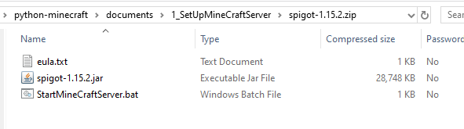
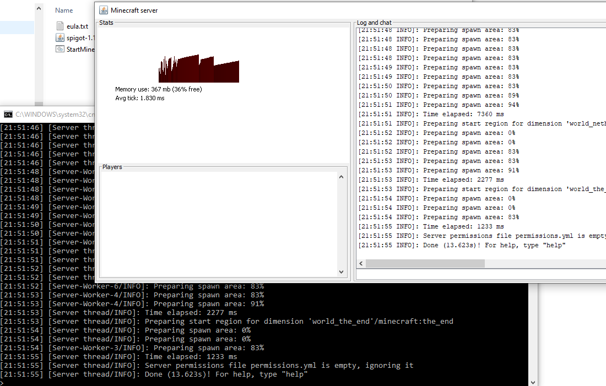
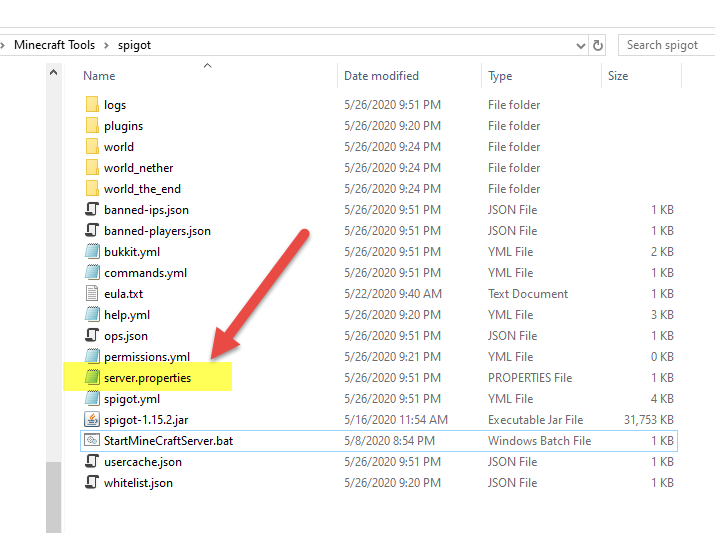

[back to main](../../README.md)

# How to SetUp a Minecraft Server (Java Edtion)

## 1 Different versions of Minccraft servers

### 1.1 Vanilla

A “vanilla” Minecraft server is an unmodified server and it is in the original format directly from the creator (Mojang).
Vanilla Minecraft has no support for plugins.
Yuu can download it from  <https://www.minecraft.net/en-us/download/server/>

### 1.2 CraftBukkit

CraftBukkit is a modified version of the Vanilla Minecraft server files.  The Bukkit team has modified it in such a way that allows for plugins to be used with the game.

### 1.3 Spigot

Spigot was created from the CraftBukkit source code, and has been highly optimized for performance

## 2 Download Minecraft server

You can download Vanilla, CraftBukkit or Spigot from <https://getbukkit.org/download/>, but the build was not updated to latest build when I checked it.

I went to <https://hub.spigotmc.org/jenkins/job/BuildTools/> downloaded the spigot buildTool, and built the latest version from source code.

You could download my build of spigot server from my page below:

- **[click to download minecraft_spigot-1.15.2.zip](./minecraft_spigot-1.15.2.zip)**
- **[click to download minecraft_spigot-1.16.1.zip](./minecraft_spigot-1.16.1.zip)**

## 3 Download and install Java

If you didn't have java be installed in your computer, you need got to <https://java.com/en/download/>, and click the "Java Download" button.
But note that when you install java, please make sure to check **"NO"** to any other App like Yahoo Search,  and select **Do NOT update browser setting** and click Next.

- **[link to download Java](https://java.com/en/download/)**

## 4 Run Spigot Minecraft Server

After installing the Java, and downloading the spigot zip file. You can unzip the spigot-1.15.2.zip. The zip file has 3 files:

Create a folder and put 3 files in it.
Then you can click **"StartMineCraftServer.bat"**, the server will start like below:

The command in the .bat file is like below
`java -Xms512M -Xmx1024M -jar spigot-1.15.2.jar`

**if you are using mac, you can't run bat file, you have to run the java command in your terminal**

If you don't want see the gui(Graphic User Interface) or want to incease min memory use, you could change the start script. ex:
`java -Xms1G -Xmx1G -XX:+UseConcMarkSweepGC -jar spigot-1.15.2.jar nogui`

## 5 Configure the Minecraft Server

After you first time run the minecraft server, you will find the folder will has couple files and folder be created:

You can update the server.properties to change the server settings.
For detail please visit <https://minecraft.gamepedia.com/Server.properties>.

---

- [Continue to RespberryJuice plugin](./1.2_HowToEnablePythonForMineCraftServer.md)

