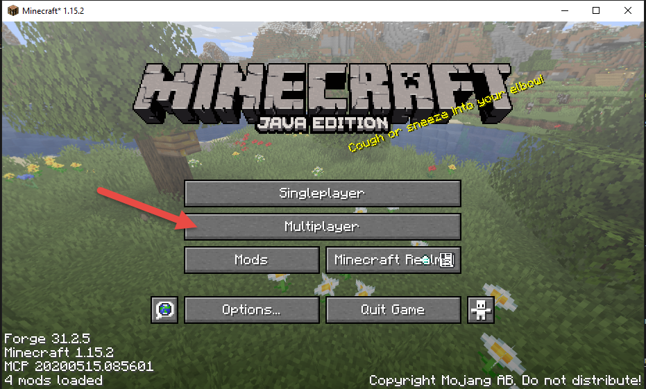
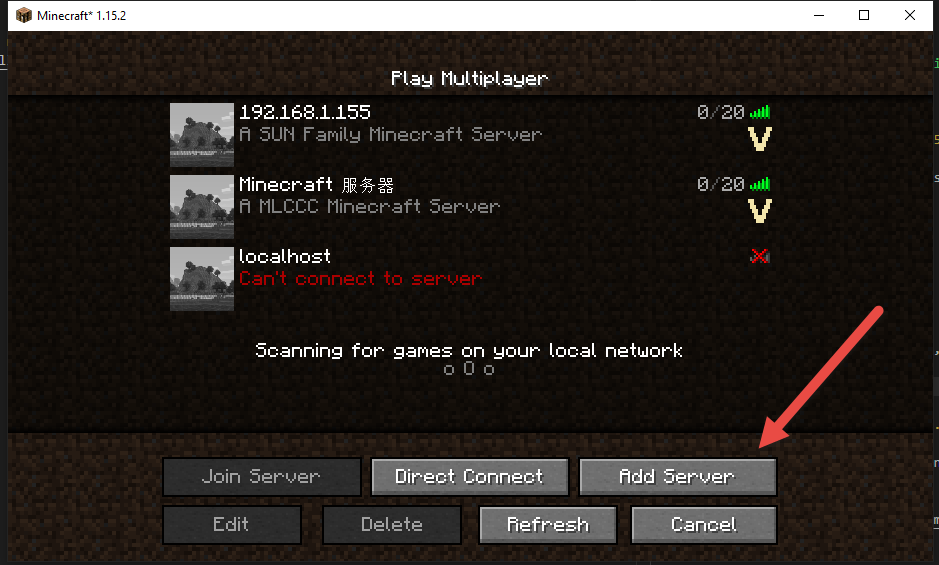
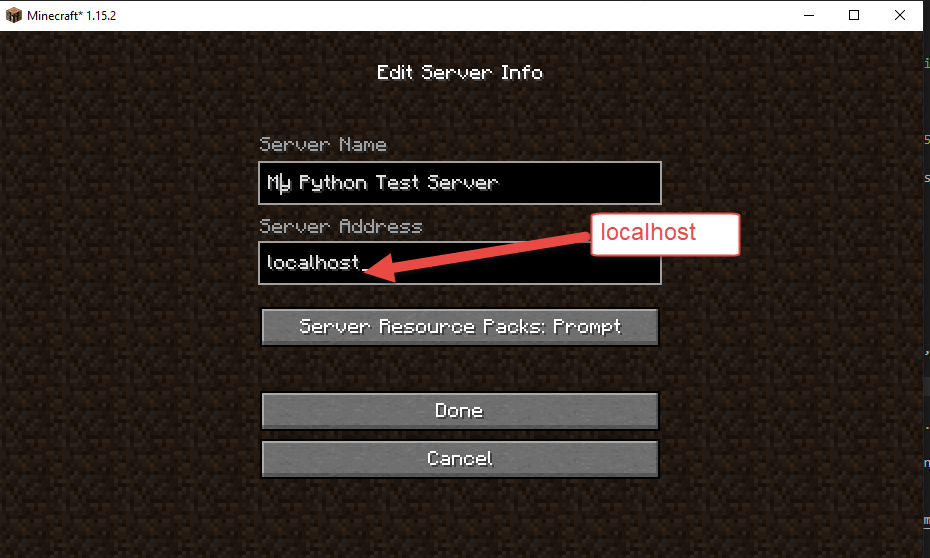
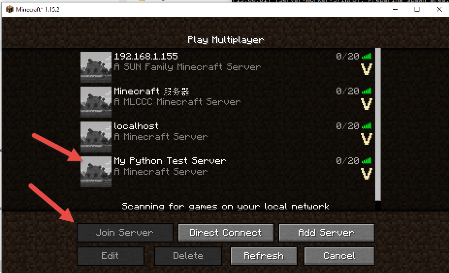

[back to main](../../README.md)

# How to SetUp a Minecraft Server (Java Edition)

We use Minecraft 1.15.2 for both server and client.

Your PC have a speical address and it never changed **"localhost"** or **"127.0.0.1"**.

Please follow steps below to join your Minecraft server

## Step 1

**Open Minecraft make user use the saver version of the Minecraft server, and click "Multiplayer"**

## Step 2

**In the Multiplayer page, select Add Server**

## Step 3

**Give a server name,  and put `localhost` in the Server Address box"**

## Step 4

**Back to Multiplayer Screen, you will see your new added server in the list., Click that, and click "Join Server"**

---

[back to main - continue on Python mcpi installation](../../README.md#install-mcip-python-module)
