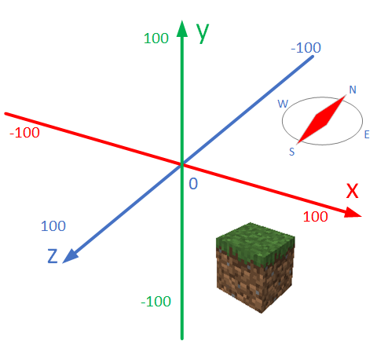
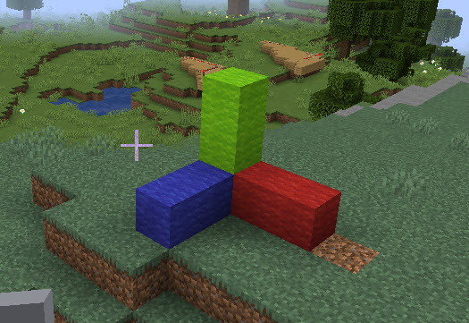

[back to main](../../README.md)

# Learn Python With MineCraft

  *- have fun with programming and game*

## 2.1 Understand the coordinates of minecraft

Minecraft coordinates is different than what we learn from geometry. you need keep below picture in mind when you do the minecraft coding.


For basic python syntax, pleas check [Python syntax](https://www.w3schools.com/python/python_syntax.asp) for details.
Below mission will use `print` and command from minecraft api `mcpi`

### To use below code example, please make sure use below code before the sample code.

```python
import mcpi_e.minecraft as minecraft
import mcpi_e.block as block
from math import *

address="127.0.0.1" # change to address of your minecraft server
name ="change to your user name"
mc = minecraft.Minecraft.create(address,4711,name)
pos=mc.player.getTilePos()
```

### - [Mission-1.1] Find your location

Use mcpi module to find the position (x,y,z) of the block your player stand on.
Use Python `print` command to display your location:

```python
pos= #get your position
print("pos: x:{},y:{},z:{}".format(pos.x,pos.y,pos.z))
```

hint:

```python
#return position with intiger number like (0,1,-10)
pos=mc.player.getTilePos()

# return posoition with float number like (1.02,1.23,-10.1)
pos=mc.player.getPos()
```

### - [Mission-1.2] Find the block type id of the block you are standing

Use this link to check the name of the block type id:

[ Minecraft ID list](https://minecraft-ids.grahamedgecombe.com/)

Use `getBlock` command to find the block type:

```python
x=100
y=10
z=-10
id=mc.getBlock(x,y,z)
print("blockId:",id)
```

### - [Mission-1.3] Teleport to an exact position

Let me know how you die after teleport to a position :)

Code example:

```python
#move you to a given location
x=100
y=100
z=-10
print("teleport me to: x:{},y:{},z:{}".format(x,y,z))
mc.player.setTilePos(x,y,z)
```

### - [Mission-1.4] Teleport you to one direction with 100 blocks

Find out how to move yourselfe to east 100, then north, then west, then top etc.
use key `F3` to check your location after transport.

### - [Mission-1.5] Place a block on your location

Try place a watermelon beside you.

```python
# place a block

(x,y,z)=pos=mc.player.getTilePos()

mc.setBlock(x,y,z,103)

```
#### - [Mission-1.6] Use Python place multiple blocks point direction of x,y,z

Use python code to place color block like below

```python
mc=Minecraft.create(serverAddress,pythonApiPort,playerName)
pos=mc.player.getTilePos()
(x,y,z)=pos=mc.player.getPos()

mc.setBlock(x+1,y,z,block.WOOL_GREEN)
mc.setBlock(x+2,y,z,block.WOOL_RED)
mc.setBlock(x+3,y,z,block.WOOL_BLUE)
```



[back to main](../../README.md)
